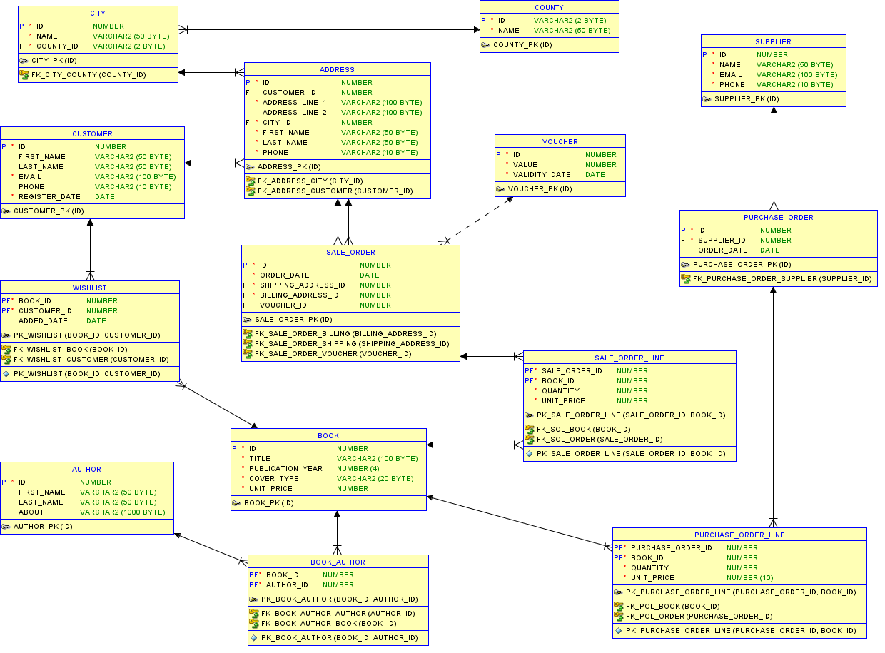
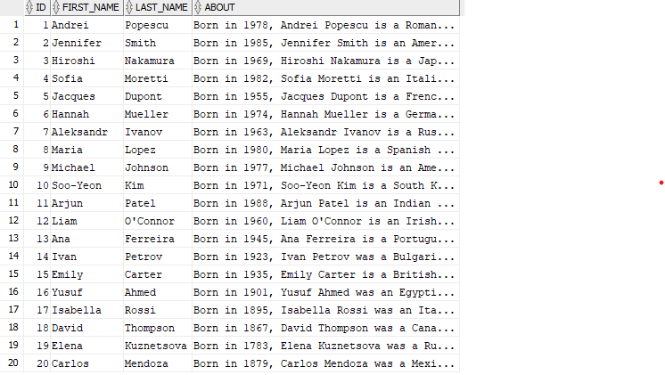
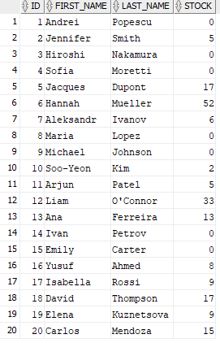
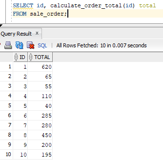
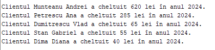
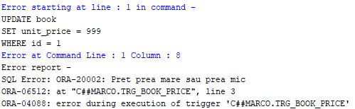

# Bookstore Management System
Design, Implementation, Non-procedural and Procedural Exploitation of a Relational Database

## Project Structure
```
bookstore_management_system/
├── documentation/
│   ├── er_diagram.png
│   └── relational_schema.md
├── scripts/
│   ├── 01_create_tables.sql
│   ├── 02_insert_data.sql
│   ├── 03_calculate_order_total.sql
│   ├── 04_get_annual_report.sql
│   ├── 05_get_supplier_report.sql
│   ├── 06_trg_book_price.sql
│   ├── 07_trg_purchase_order.sql
│   └── 08_queries.sql
├── tables/
│   ├── address.png
│   ├── author.png
│   ├── book.png
│   ├── book_author.png
│   ├── city.png
│   ├── county.png
│   ├── customer.png
│   ├── purchase_order.png
│   ├── purchase_order_line.png
│   ├── sale_order.png
│   ├── sale_order_line.png
│   ├── supplier.png
│   ├── voucher.png
│   └── wishlist.png
├── outputs/
│   ├── calculate_order_total.png
│   ├── get_annual_report.png
│   ├── get_supplier_report.png
│   ├── trg_book_price.png
│   ├── trg_purchase_order.png
│   ├── query_1.png
│   ├── query_2.png
│   ├── query_3.png
│   ├── query_4.png
│   └── query_5.png
└── README.md
```

## Installation
Execute scripts in order (using Oracle SQL Developer)  
@scripts/01_create_tables.sql  
@scripts/02_insert_data.sql  
@scripts/03_calculate_order_total.sql  
@scripts/04_get_annual_report.sql  
@scripts/05_get_supplier_report.sql  
@scripts/06_trg_book_price.sql  
@scripts/07_trg_purchase_order.sql  
@scripts/08_queries.sql  

## ER Diagram


## Table Example


## Complex Query Example 
```sql
--query_2 Write a query to calculate authors' stock levels by subtracting total books sold from total books purchased, displaying results for all authors
SELECT a.id, a.first_name, a.last_name,
NVL((SELECT SUM(pol.quantity) 
FROM author a2 LEFT JOIN book_author ba ON a2.id = ba.author_id
LEFT JOIN book b ON ba.book_id = b.id
LEFT JOIN purchase_order_line pol ON pol.book_id = b.id
WHERE a2.id = a.id), 0)
-
NVL((SELECT SUM(sol.quantity) 
FROM author a2 LEFT JOIN book_author ba ON a2.id = ba.author_id
LEFT JOIN book b ON ba.book_id = b.id
LEFT JOIN sale_order_line sol ON sol.book_id = b.id
WHERE a2.id = a.id), 0) STOCK
FROM author a;
```


## Function Example
```sql
CREATE OR REPLACE FUNCTION calculate_order_total(p_order_id IN NUMBER)
RETURN NUMBER 
IS
    v_total NUMBER;
BEGIN
    SELECT 
    SUM(sol.quantity * sol.unit_price) - NVL(MAX(v.value), 0)
    INTO v_total
    FROM sale_order so
    LEFT JOIN sale_order_line sol ON so.id = sol.sale_order_id
    LEFT JOIN voucher v ON v.id = so.voucher_id
    WHERE so.id = p_order_id;

    RETURN v_total;

EXCEPTION
    WHEN NO_DATA_FOUND THEN
        RETURN NULL;
    WHEN OTHERS THEN
        RETURN NULL;
END;
```


## Procedure Example
```sql
CREATE OR REPLACE PROCEDURE get_annual_report(p_year IN NUMBER) IS
BEGIN
    FOR customer_rec IN (
        SELECT 
            first_name || ' ' || last_name AS customer_name,
            SUM(order_total) AS total_spent
        FROM (
            SELECT 
                c.first_name, 
                c.last_name, 
                NVL(SUM(sol.quantity * sol.unit_price), 0) - NVL(MAX(v.value), 0) AS order_total
            FROM customer c
            JOIN address a ON c.id = a.customer_id
            JOIN sale_order so 
                ON a.id = so.billing_address_id 
                AND EXTRACT(YEAR FROM so.order_date) = p_year
            JOIN sale_order_line sol 
                ON so.id = sol.sale_order_id
            LEFT JOIN voucher v 
                ON so.voucher_id = v.id
            GROUP BY so.id, c.first_name, c.last_name
        )
        GROUP BY first_name, last_name
        ORDER BY total_spent DESC
    ) LOOP
        DBMS_OUTPUT.PUT_LINE(
            'Clientul ' || customer_rec.customer_name || 
            ' a cheltuit ' || customer_rec.total_spent || ' lei în anul ' || p_year || '.'
        );
    END LOOP;

EXCEPTION
    WHEN NO_DATA_FOUND THEN
    DBMS_OUTPUT.PUT_LINE('Eroare: no data found');
    WHEN TOO_MANY_ROWS THEN
    DBMS_OUTPUT.PUT_LINE('Eroare: too many rows');
    WHEN OTHERS THEN
    DBMS_OUTPUT.PUT_LINE('Eroare: ' || SQLERRM);

END get_annual_report;

BEGIN
get_annual_report(2024);
END;
```


## Trigger Example
```sql
create or replace TRIGGER trg_book_price
    BEFORE UPDATE OF unit_price ON book
    FOR EACH ROW
BEGIN
    IF (:NEW.unit_price > 2 * :OLD.unit_price OR :NEW.unit_price < 0.5 * :OLD.unit_price) THEN
        RAISE_APPLICATION_ERROR(-20002, 'Pret prea mare sau prea mic');
    END IF;
END;
```


## Technologies Used

- **Database:** Oracle Database XE  
- **Tools:** SQL Developer  
